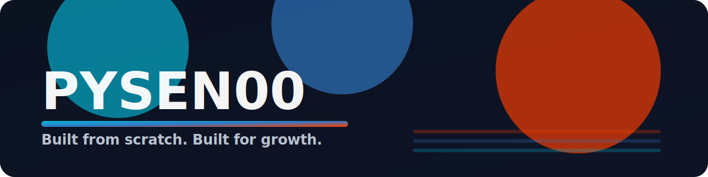
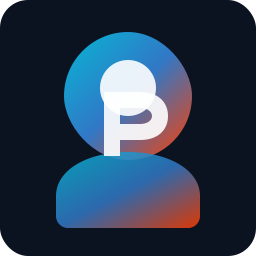

  

  

<h1 align="center">Hey, I'm Pysen 👋</h1>

<em>Built from scratch. Built for growth.</em>

## TL;DR
- Ships crisp, fast UIs with Svelte, TypeScript, and Tailwind.
- Believes in small lovable releases, measured iterations, and solid DX.
- Building across: <a href="https://github.com/YntraAB">YntraAB</a> and <a href="https://github.com/Rootbay">Rootbay</a>.

## Signature Stack

  
  
  

## Build Principles
- Minimum lovable release > perfect later; keep momentum high.
- Performance by default: tiny bundles, fast starts, smooth transitions.
- Typed everywhere for confidence; automate the boring parts.
- Accessibility and details that make UIs feel “snappy-right”.

## Now Building
- <strong><a href="https://github.com/YntraAB">YntraAB</a></strong>: product experiments and internal tools from zero to usable.
- <strong><a href="https://github.com/Rootbay">Rootbay</a></strong>: open-source utilities, componentry, and workflow polish.

## Highlights
- Shipped multiple Svelte/TypeScript projects from idea to first users.
- Designed lean UI systems with Tailwind that scale without bloat.
- Prefer simple tooling, clean code paths, and measurable wins.

## Selected Projects
- Add a couple of flagship repos here (one-liners that explain value and outcome). Want help writing them? Ping me on Discord.

## Stats

  
  

## Contact
- Discord: `realpysen`

---

<!-- Avatar: replace assets/avatar.svg with your own image (e.g., assets/avatar.png) and update the path above if needed. -->
